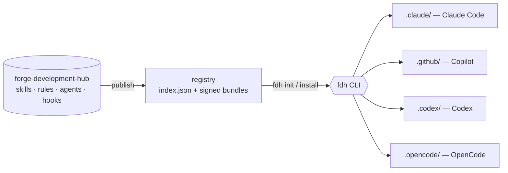

# fdh — Forge Development Hub CLI

[](https://github.com/askenaz-dev/forge-development-hub-cli/actions/workflows/ci.yml)
[](https://github.com/askenaz-dev/forge-development-hub-cli/releases)
[](https://www.npmjs.com/package/@askenaz-dev/fdh)
[](LICENSE)

**One command to give every AI coding agent the same skills, rules, agents, and hooks.**

`fdh` installs **Forge harnesses** — curated bundles of *skills, rules, agents, and hooks* — from a shared Git-backed hub into the AI coding agents your team already uses: **Claude Code, GitHub Copilot, OpenAI Codex, and OpenCode**. Author a capability once; `fdh` materializes it, byte-identical, across all four ecosystems — no copy-paste drift.

> **Pre-release.** Interfaces are still stabilizing. Known gaps: [`docs/KNOWN_ISSUES.md`](docs/KNOWN_ISSUES.md).

## Why fdh

- **Write once, run in every agent.** A component authored in the hub installs into `.claude/`, `.github/`, `.codex/`, and `.opencode/` with a single command.
- **Curated harnesses, not a free-for-all.** Install a vetted bundle with `fdh init`, or pick components à la carte with `fdh install`. Everything is versioned, hash-verified, and security-scan gated.
- **Reproducible + scoped.** Install per-project (`.fdh/manifest.yaml` + lockfile) or per-user; the lock keeps installs deterministic and updatable.
- **Spec-governed.** Every behavior traces to an OpenSpec requirement — the spec is the source of truth, not the code.

## Quickstart

```sh
# zero-install — scaffold a project's harness interactively
npx @askenaz-dev/fdh init

# …or install persistently
npm i -g @askenaz-dev/fdh
fdh init
```

→ [30-second walkthrough](docs/quickstart.md) · [zero-to-your-first-skill](docs/getting-started.md)

## How it works



`fdh` reads the hub's published registry, resolves a harness (or individual components), verifies each bundle's content hash, and materializes it into every targeted agent's conventions. The **portal** at [fdh.askenaz.dev](https://fdh.askenaz.dev) browses the same catalog in a UI.

## Installation

```sh
# macOS / Linux — one-liner
curl -fsSL https://raw.githubusercontent.com/askenaz-dev/forge-development-hub-cli/main/scripts/install.sh | bash
```
```powershell
# Windows — PowerShell
iwr https://raw.githubusercontent.com/askenaz-dev/forge-development-hub-cli/main/scripts/install.ps1 | iex
```
```sh
# npm (recommended) — npx for zero-install, or -g for a persistent binary
npx @askenaz-dev/fdh init
npm i -g @askenaz-dev/fdh

# Linux packages (from GitHub Releases)
sudo apt install ./fdh_<version>_linux_amd64.deb   # Debian / Ubuntu
sudo rpm -ivh   fdh_<version>_linux_amd64.rpm       # Fedora / RHEL
```

Binaries live on [GitHub Releases](https://github.com/askenaz-dev/forge-development-hub-cli/releases). For private mirrors set `FDH_RELEASES_BASE`; for air-gapped installs and PowerShell `ExecutionPolicy` workarounds see [`docs/install.md`](docs/install.md). Stable exit codes: [`docs/exit-codes.md`](docs/exit-codes.md).

## Features

- **Four agent ecosystems, one source.** Claude Code, Copilot, Codex, OpenCode — kept in sync from the hub.
- **Four primitives.** `skill`, `rule`, `agent`, `hook` — install any kind, individually or as a harness.
- **Interactive `init`.** Picks a harness and reports exactly what it installed and at what scope.
- **Scope-aware.** Project scope inside a git/`.fdh` repo (or with `--local`); user scope otherwise.
- **Verified + scanned.** Content-hash verification on every bundle; security `scan_status` surfaced in the portal.
- **Authoring loop.** Scaffold, edit, and share components back to the hub.

## Documentation

| Doc | What |
|---|---|
| [Quickstart](docs/quickstart.md) | 30 seconds to your first harness |
| [Getting started](docs/getting-started.md) | Zero to your first authored skill |
| [Installation](docs/install.md) | Channels, air-gapped, proxies, ExecutionPolicy |
| [Adapters](docs/adapters.md) | How each agent's paths are mapped |
| [Portal API](docs/portal-api.md) | The read-only catalog wire protocol |
| [IdP profiles](docs/idp-profiles.md) | Portal auth: `local` vs `external` |
| [Troubleshooting](docs/troubleshooting.md) · [Exit codes](docs/exit-codes.md) | When things go sideways |

## Repository layout

```
cmd/fdh/                   # main + root cobra command
internal/cli/              # one file per CLI subcommand
internal/portalapi/        # the portal HTTP API (reuses pkg/registry)
pkg/registry/              # Registry interface + Git/HTTP implementations
pkg/adapters/              # manifest-driven agent path map
pkg/bundle/                # bundle parsing, validation, canonical hash
deploy/helm/fdh-portal/    # the portal Helm chart (API + Web)
docs/                      # quickstart, guides, references
```

## Build

```sh
task build   # build the binary for the current host
task test    # unit + integration tests
task lint    # golangci-lint
task e2e     # end-to-end test against a fixture registry
task release # produce all platform archives
```

[Task](https://taskfile.dev) is the build runner — one cross-platform binary, identical syntax everywhere, no `make`.

## Spec-governed development

This repo is the **implementation**. Every requirement lives in the OpenSpec workspace at [askenaz-dev/forge-specs](https://github.com/askenaz-dev/forge-specs) (`openspec/specs/`). If behavior disagrees with the spec, the spec wins — open a change there rather than altering behavior here.

## Contributing

PRs land against `main`; CI must pass on macOS, Linux, and Windows. Any change to runtime behavior needs a matching OpenSpec change.

## License

MIT — see [LICENSE](LICENSE).
